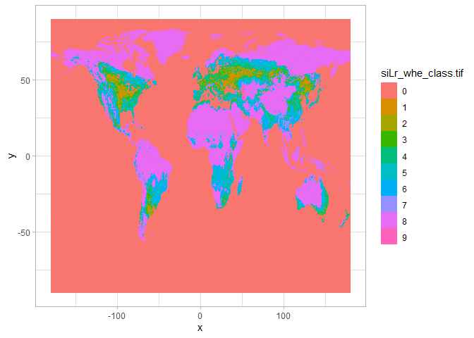
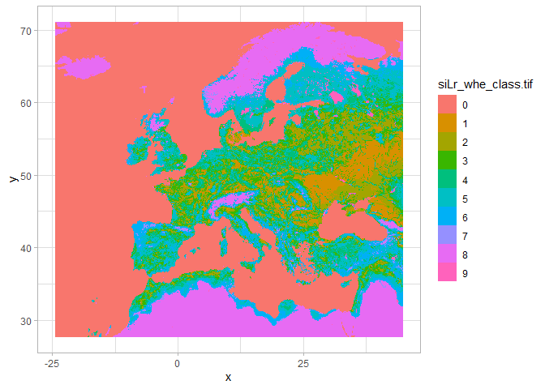
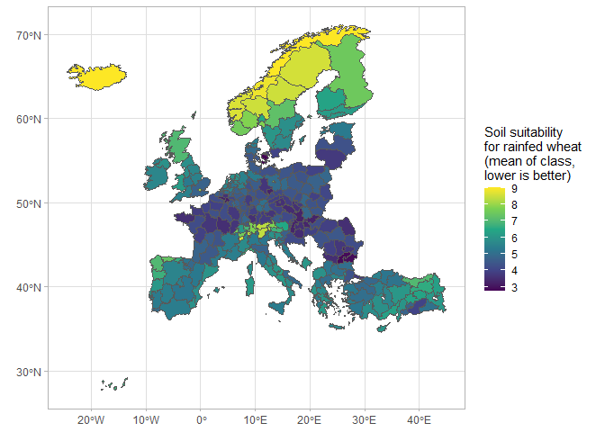

Readme
================

## Purpose

Collect soil quality data and aggregate up to NUTS2 level to join to
Rosés-Wolf database on regional GDP

## Download data

You can download the data in excel format at [this
link](data/soil_suitability.xlsx)

It looks like this:

<div id="qbasgzimwk" style="overflow-x:auto;overflow-y:auto;width:auto;height:auto;">
  <table class="gt_table">
  <thead class="gt_header">
    <tr>
      <td colspan="7" class="gt_heading gt_title gt_font_normal gt_bottom_border" style>Extract of soil quality data</td>
    </tr>
    
  </thead>
  <thead class="gt_col_headings">
    <tr>
      <th class="gt_col_heading gt_columns_bottom_border gt_right" rowspan="1" colspan="1" scope="col">id</th>
      <th class="gt_col_heading gt_columns_bottom_border gt_left" rowspan="1" colspan="1" scope="col">nuts</th>
      <th class="gt_col_heading gt_columns_bottom_border gt_left" rowspan="1" colspan="1" scope="col">region</th>
      <th class="gt_col_heading gt_columns_bottom_border gt_left" rowspan="1" colspan="1" scope="col">country</th>
      <th class="gt_col_heading gt_columns_bottom_border gt_center" rowspan="1" colspan="1" scope="col">suitability_class_mean</th>
      <th class="gt_col_heading gt_columns_bottom_border gt_center" rowspan="1" colspan="1" scope="col">suitability_class_max</th>
      <th class="gt_col_heading gt_columns_bottom_border gt_center" rowspan="1" colspan="1" scope="col">suitability_class_min</th>
    </tr>
  </thead>
  <tbody class="gt_table_body">
    <tr><td class="gt_row gt_right">1</td>
<td class="gt_row gt_left">AT11</td>
<td class="gt_row gt_left">Burgenland</td>
<td class="gt_row gt_left">Austria</td>
<td class="gt_row gt_center">3.957746</td>
<td class="gt_row gt_center">10</td>
<td class="gt_row gt_center">2</td></tr>
    <tr><td class="gt_row gt_right">2</td>
<td class="gt_row gt_left">AT12+AT13</td>
<td class="gt_row gt_left">Lower Austria</td>
<td class="gt_row gt_left">Austria</td>
<td class="gt_row gt_center">4.123167</td>
<td class="gt_row gt_center">8</td>
<td class="gt_row gt_center">2</td></tr>
    <tr><td class="gt_row gt_right">3</td>
<td class="gt_row gt_left">AT21</td>
<td class="gt_row gt_left">Carinthia</td>
<td class="gt_row gt_left">Austria</td>
<td class="gt_row gt_center">6.762500</td>
<td class="gt_row gt_center">9</td>
<td class="gt_row gt_center">2</td></tr>
    <tr><td class="gt_row gt_right">4</td>
<td class="gt_row gt_left">AT22</td>
<td class="gt_row gt_left">Styria</td>
<td class="gt_row gt_left">Austria</td>
<td class="gt_row gt_center">6.494774</td>
<td class="gt_row gt_center">9</td>
<td class="gt_row gt_center">2</td></tr>
    <tr><td class="gt_row gt_right">5</td>
<td class="gt_row gt_left">AT31</td>
<td class="gt_row gt_left">Upper Austria</td>
<td class="gt_row gt_left">Austria</td>
<td class="gt_row gt_center">4.587379</td>
<td class="gt_row gt_center">9</td>
<td class="gt_row gt_center">2</td></tr>
    <tr><td class="gt_row gt_right">6</td>
<td class="gt_row gt_left">AT32</td>
<td class="gt_row gt_left">Salzburg</td>
<td class="gt_row gt_left">Austria</td>
<td class="gt_row gt_center">7.786885</td>
<td class="gt_row gt_center">9</td>
<td class="gt_row gt_center">2</td></tr>
    <tr><td class="gt_row gt_right">7</td>
<td class="gt_row gt_left">AT33</td>
<td class="gt_row gt_left">Tyrol</td>
<td class="gt_row gt_left">Austria</td>
<td class="gt_row gt_center">8.324074</td>
<td class="gt_row gt_center">9</td>
<td class="gt_row gt_center">5</td></tr>
    <tr><td class="gt_row gt_right">8</td>
<td class="gt_row gt_left">AT34</td>
<td class="gt_row gt_left">Vorarlberg</td>
<td class="gt_row gt_left">Austria</td>
<td class="gt_row gt_center">7.837209</td>
<td class="gt_row gt_center">9</td>
<td class="gt_row gt_center">5</td></tr>
    <tr><td class="gt_row gt_right">9</td>
<td class="gt_row gt_left">BE10+BE24+BE31</td>
<td class="gt_row gt_left">Brabant</td>
<td class="gt_row gt_left">Belgium</td>
<td class="gt_row gt_center">3.586207</td>
<td class="gt_row gt_center">6</td>
<td class="gt_row gt_center">2</td></tr>
    <tr><td class="gt_row gt_right">10</td>
<td class="gt_row gt_left">BE21</td>
<td class="gt_row gt_left">Antwerp</td>
<td class="gt_row gt_left">Belgium</td>
<td class="gt_row gt_center">5.074074</td>
<td class="gt_row gt_center">8</td>
<td class="gt_row gt_center">4</td></tr>
  </tbody>
  
  
</table>
</div>

### Data

Data on wheat suitability from FAO-GAEZ 4, available at the [following
link](https://gaez-data-portal-hqfao.hub.arcgis.com/pages/data-viewer).

The data viewer presents the data like so:

``` r
knitr::include_graphics("images/fao_interface.PNG")
```


The specific extract information is:

<div id="jknymxclgl" style="overflow-x:auto;overflow-y:auto;width:auto;height:auto;">
  
  <table class="gt_table">
  <thead class="gt_header">
    <tr>
      <td colspan="2" class="gt_heading gt_title gt_font_normal gt_bottom_border" style>FAO-GAEZ 4 metadata</td>
    </tr>
    
  </thead>
  <thead class="gt_col_headings">
    <tr>
      <th class="gt_col_heading gt_columns_bottom_border gt_left" rowspan="1" colspan="1" scope="col">Field</th>
      <th class="gt_col_heading gt_columns_bottom_border gt_left" rowspan="1" colspan="1" scope="col">Value</th>
    </tr>
  </thead>
  <tbody class="gt_table_body">
    <tr><td class="gt_row gt_left">Theme</td>
<td class="gt_row gt_left">Suitability and Attainable Yield</td></tr>
    <tr><td class="gt_row gt_left">Sub-theme</td>
<td class="gt_row gt_left">Suitability Class</td></tr>
    <tr><td class="gt_row gt_left">Variable name</td>
<td class="gt_row gt_left">Crop suitability index in classes</td></tr>
    <tr><td class="gt_row gt_left">Time period</td>
<td class="gt_row gt_left">1981-2010</td></tr>
    <tr><td class="gt_row gt_left">Climate data source</td>
<td class="gt_row gt_left">CRUTS32</td></tr>
    <tr><td class="gt_row gt_left">Crop</td>
<td class="gt_row gt_left">Wheat</td></tr>
    <tr><td class="gt_row gt_left">Water supply</td>
<td class="gt_row gt_left">Rainfed</td></tr>
    <tr><td class="gt_row gt_left">Input level</td>
<td class="gt_row gt_left">Low</td></tr>
  </tbody>
  
  
</table>
</div>

It is in a raster format - where the earth is broken into tiles.

This is what it looks like on a map:

``` r
library(stars)

tif <- read_stars(here::here("data", "siLr_whe_class.tif"))

ggplot() +
  geom_stars(data = tif)
```



We want to aggregate this to the nuts2 levels used in the Rosés-Wolf
database on regional GDP.

### NUTS2 shapefile

The NUTS2 shapefiles are from
[Eurostat](https://ec.europa.eu/eurostat/web/gisco/geodata/reference-data/administrative-units-statistical-units/nuts)

We’re going to work in WGS84 for convenience (EPSG: 4326).

We now need to aggregate up the NUTS2 regions which are joined together
in the Rosés-Wolf database on regional GDP.

They are:

<div id="bbrjwslbzz" style="overflow-x:auto;overflow-y:auto;width:auto;height:auto;">
<table class="gt_table">
  <thead class="gt_header">
    <tr>
      <td colspan="2" class="gt_heading gt_title gt_font_normal gt_bottom_border" style>Aggregations of NUTS2 regions</td>
    </tr>
    
  </thead>
  <thead class="gt_col_headings">
    <tr>
      <th class="gt_col_heading gt_columns_bottom_border gt_left" rowspan="1" colspan="1" scope="col">NUTS2_regions</th>
      <th class="gt_col_heading gt_columns_bottom_border gt_left" rowspan="1" colspan="1" scope="col">Aggregation</th>
    </tr>
  </thead>
  <tbody class="gt_table_body">
    <tr><td class="gt_row gt_left">AT12+AT13</td>
<td class="gt_row gt_left">AT123</td></tr>
    <tr><td class="gt_row gt_left">DE71+DE72</td>
<td class="gt_row gt_left">DE712</td></tr>
    <tr><td class="gt_row gt_left">DE91+DE92</td>
<td class="gt_row gt_left">DE912</td></tr>
  </tbody>
  
  
</table>
</div>

The following chunk manipulates the shapefile to make it easier to work
with in a WGS84 projection.

``` r
library(sf)

# map <- read_sf(here::here("maps", "regions_nuts2.shp")) %>% janitor::clean_names()

# map_tbl <- map %>% as_tibble()

# map_tbl %>%
#   ggplot(aes(geometry = geometry)) +
#   geom_sf() +
#   coord_sf()

## Making the map files smaller
# library(rmapshaper)
# map_simple <- ms_simplify(map, keep = 0.1,
#                                 keep_shapes = FALSE)
# 
# map_tbl_simple <- map_simple %>% as_tibble()
# 
# map_tbl_simple %>% write_rds(here::here("maps", "NUTS2_simple.rds"))

map_simple <- read_rds(here::here("maps", "NUTS2_simple.rds")) %>% 
  st_as_sf()

map_simple <- map_simple %>% 
  st_transform(crs = 4326)
```

We want to crop to only Europe: this is what the raster file looks like
now.

``` r
# st_crop removes the raster region outside of europe
tif_bbox <- st_crop(tif, map_simple %>% st_bbox())

ggplot() +
  geom_stars(data = tif_bbox)
```



Now we want to calculate the averages within each polygon, along with
the min and max values within each polygon.

``` r
# devtools::install_github("michaeldorman/geobgu")
library(geobgu)

map_simple_avgs <-
  map_simple %>% mutate(
    suitability_class_mean = raster_extract(tif_bbox, map_simple, fun = mean, na.rm = TRUE),
    suitability_class_max = raster_extract(tif_bbox, map_simple, fun = max, na.rm = TRUE),
    suitability_class_min = raster_extract(tif_bbox, map_simple, fun = min, na.rm = TRUE)
  )
```

This is what the averaging procedure produces:



The distribution of minimum and maximum values is quite erratic. The
plot below arranges the NUTS2 regions from lowest mean of suitability
class to largest. The ribbon shows the


Here is an example of 10 random regions.

| nuts_code | suitability_class_mean | suitability_class_max | suitability_class_min |
|:----------|-----------------------:|----------------------:|----------------------:|
| HU32      |               4.222222 |                     6 |                     2 |
| PL43      |               4.927757 |                     6 |                     3 |
| DEB3      |               4.390244 |                     6 |                     2 |
| PL62      |               3.974359 |                    10 |                     2 |
| SK03      |               4.871528 |                     9 |                     2 |
| FR82      |               5.393411 |                    10 |                     2 |
| FR24      |               3.678414 |                     6 |                     2 |
| FR83      |               5.773723 |                     8 |                     2 |
| SE33      |               8.569377 |                    10 |                     6 |
| ES70      |               6.765306 |                     9 |                     4 |

### Join to Rosés-Wolf database on regional GDP

``` r
# read in data file
df <- haven::read_dta(here::here("data", "RosesWolf_Regional_Fahad.dta"))

# keep unique nuts codes
df <- df %>%
  distinct(id, nuts, region, country)

# change label of joined regions
map_simple_avgs <- map_simple_avgs %>%
  st_set_geometry(NULL) %>%
  mutate(nuts = case_when(
    nuts_code == "AT123" ~ "AT12+AT13",
    nuts_code == "DE712" ~ "DE71+DE72",
    nuts_code == "DE912" ~ "DE91+DE92",
    TRUE ~ nuts_code
  ))

# join together
df_out <- df %>%
  left_join(map_simple_avgs) %>%
  select(-nuts_code)

# df_out %>% 
#   write_rds(here::here("data", "soil_suitability.rds"))

# df_out %>% 
#   write.csv(here::here("data", "soil_suitability.csv"))
```
